<div align="center">

```
$ whoami
```

<h1>
  
</h1>


<a href="https://your-portfolio-link.com"></a>
<a href="https://linkedin.com/in/your-handle"></a>
<a href="mailto:your-email@example.com"></a>

<br/><br/>

<!-- Self-contained animated SVG mascot, no external service required -->


</div>

<br/>

<!-- Self-contained animated SVG, no external service required -->


<br/><br/>

```
$ cat manifesto.md
```

- 🔭 Right now: shipping platform products end-to-end, solo — design, code, deploy
- 🧠 Background: full-stack web, Python scripting, ML/DL, and a bit of hardware
- 🎓 In parallel: B.Tech CSE (AIML), India
- ⚙️ Philosophy: fewer half-finished ideas, more things that actually ship

<br/>

<table width="100%">
<tr>
<td width="50%" valign="top">

### `~/stack`


<br/><br/>


</td>
<td width="50%" valign="top">

### `~/trophies`


</td>
</tr>
</table>

<br/>

<table width="100%">
<tr>
<td width="50%" valign="top">

### `~/streak`


</td>
<td width="50%" valign="top">

### `~/activity`


</td>
</tr>
</table>

<br/>

```
$ ls -la ./builds
```

<table width="100%">
<tr>
<td width="50%" valign="top">

**📚 Penbrio** →
Where students actually go to find and share course material, instead of digging through ten different group chats.
`Next.js` `Full-stack`

</td>
<td width="50%" valign="top">

**🎮 VECTOR//SHIFT**
An arena shooter where the floor itself turns against you — ricochet shots and sudden gravity flips, 2 to 12 players.
`Multiplayer` `Vercel`

</td>
</tr>
<tr>
<td width="50%" valign="top">

**✅ Repo Auto-Grader**
Push a repo, get graded — a GitHub Actions pipeline wired to a Next.js dashboard so nobody's grading assignments by hand.
`GitHub Actions` `Next.js`

</td>
<td width="50%" valign="top">

**🧪 Materials Science Studio**
Think Blender, but for crystal structures — a 3D editor with ML-driven simulation underneath.
`3D` `ML`

</td>
</tr>
</table>

<br/>

<div align="center">

```
$ tail -f status.log
```

**building in public, one late-night commit at a time.**
open to interesting problems — reach out above. ⚡


</div>
