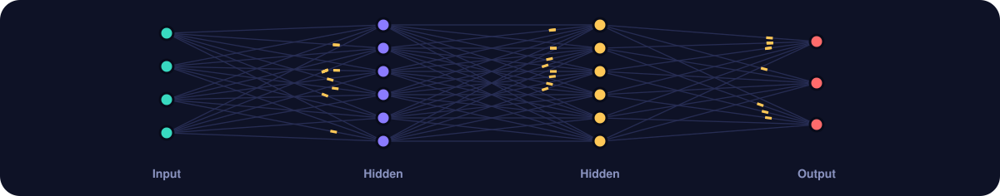
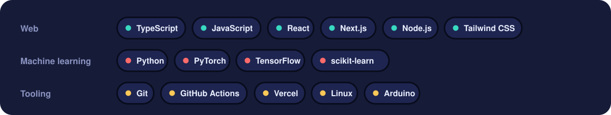
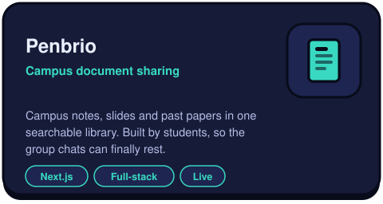
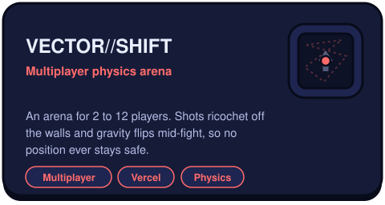
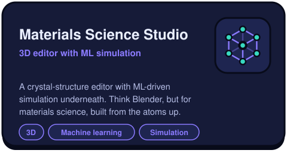
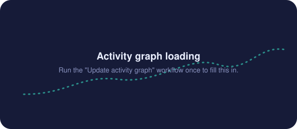

  

 

  

<table width="100%">
<tr>
<td width="33%" valign="top">

**What I'm doing now** 
Shipping platform products end to end, solo: design, code, deploy.

</td>
<td width="33%" valign="top">

**Where I come from** 
Full-stack web, Python scripting, ML and deep learning, and a bit of hardware.

</td>
<td width="33%" valign="top">

**How I work** 
Fewer half-finished ideas, more things that actually ship. B.Tech CSE (AIML) runs alongside.

</td>
</tr>
</table>

 

  

<table width="100%">
<tr>
<td width="50%" valign="top">

</td>
<td width="50%" valign="top">

</td>
</tr>
<tr>
<td width="50%" valign="top">

</td>
<td width="50%" valign="top">

</td>
</tr>
</table>

 

<table width="100%">
<tr>
<td width="50%" valign="middle">

</td>
<td width="50%" valign="middle">

</td>
</tr>
</table>

 

  
  
  

 

